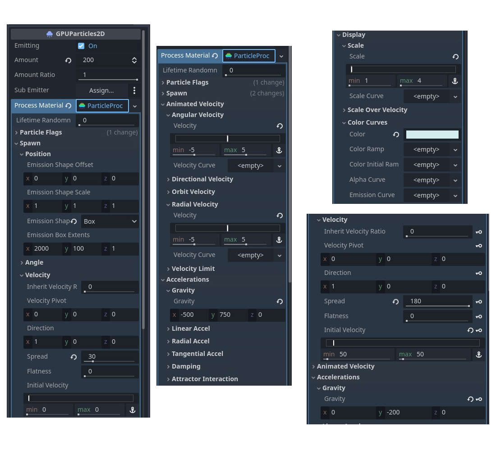
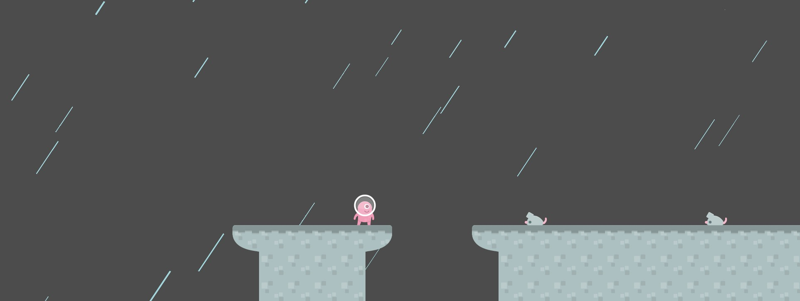
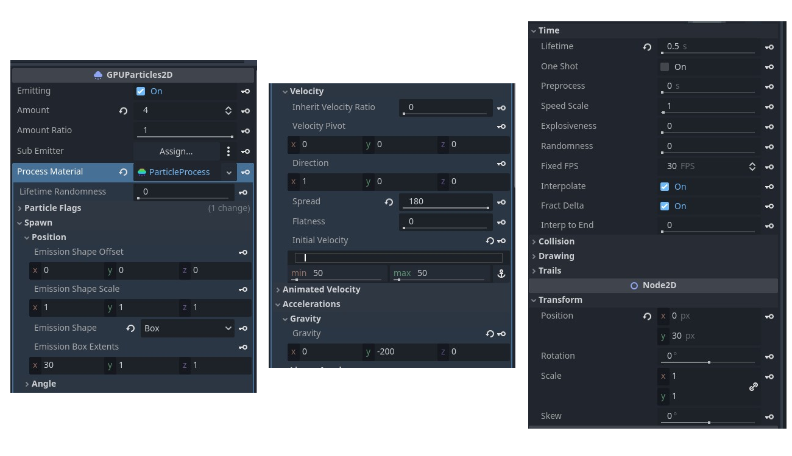
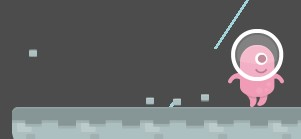
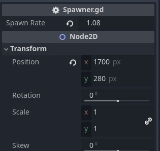
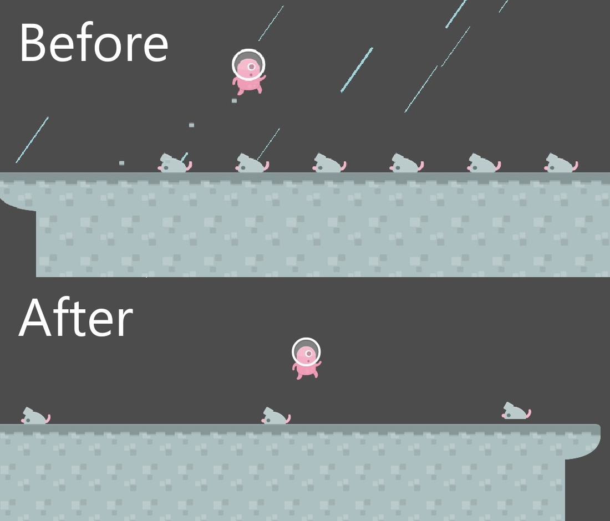
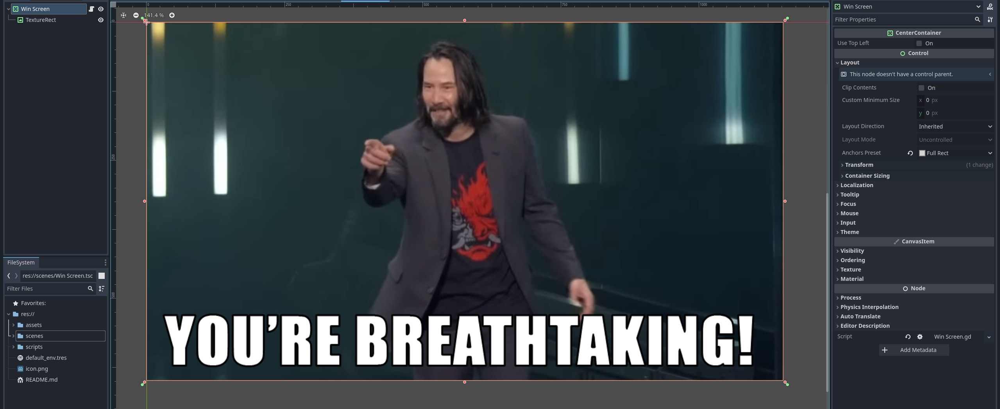
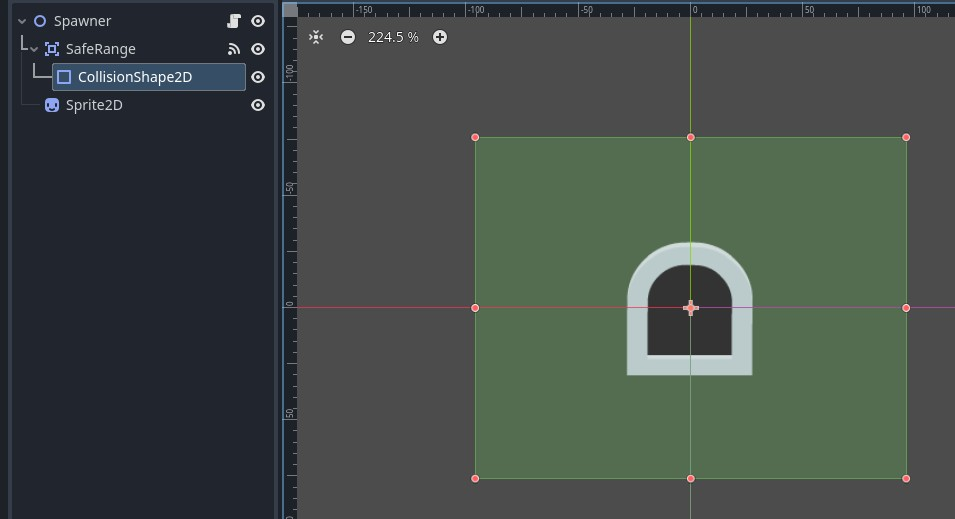
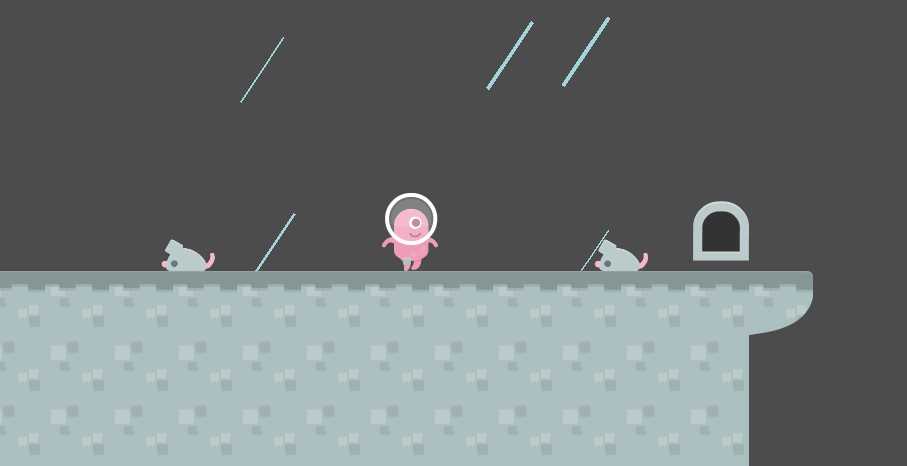
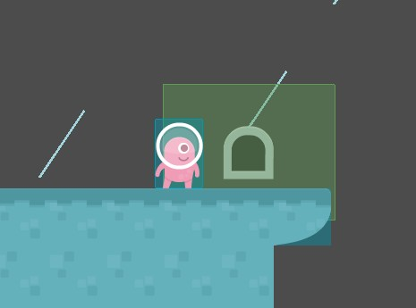

# Game Development - Tutorial 8

- **Name:** Feru Pratama Kartajaya
- **NPM:** 2106750351
- **Topic:** Game Polishing & Balancing

---

## Latihan: Particles & Spawn Rates

### Particles for Effect
Saya melakukan polishing dengan menambahkan elemen partikel kepada dua elemen dari game: background level dan pergerakan pemain. Untuk background level, saya menggunakan GPUParticles2D untuk menciptakan efek hujan dengan setting berikut. Elemen telah disesuaikan agar efek hujan dapat terlihat di seluruh level.




Selain itu, saya juga menambahkan partikel yang akan muncul di sekitar kaki pemain selama ia berjalan di lantai.



```py
# Player.gd
@onready var particle = $GPUParticles2D


func get_input():
	velocity.x = 0
	if is_on_floor() and Input.is_action_just_pressed('jump'):
		velocity.y = jump_speed
	if Input.is_action_pressed('right'):
		velocity.x += speed
		if is_on_floor():
			particle.set_emitting(true)
	elif Input.is_action_pressed('left'):
		velocity.x -= speed
		if is_on_floor():
			particle.set_emitting(true)
	else:
		particle.set_emitting(false)
```



### Adjusting Spawner Rates

Saya mengubah spawn rate untuk spawner musuh dari nilai default 0.3 detik menjadi 1.08 detik. Setelah perubahan, runtutan musuh akan lebih mudah untuk dilewati. Untuk membuat gameplay sedikit lebih menantang, saya juga sedikit mengurangi kekuatan loncatan pemain.




## Polishing dan Balancing Tambahan

### Improved Win Screen

Win Screen telah disesuaikan menjadi kumpulan node Control agar posisi gambar yang ditampilkan tertata dengan lebih baik. Saya juga menambahkan sebuah script yang akan mengembalikan pemain ke level setelah 3 detik berada di Win Screen.



```py
# Win Screen.gd
extends CenterContainer


func _ready() -> void:
	await get_tree().create_timer(3).timeout
	get_tree().call_deferred("change_scene_to_file", "res://scenes/Level 1.tscn")
```

### Predictable Spawner

Saat ini, spawner tidak memiliki indikator visual untuk menandakan posisinya. Hal ini dapat membuat pemain kesulitan untuk mengetahui di mana ia harus menghindari spawner saat ia mendekati. Terlebih lagi, sifat spawner yang selalu melakukan spawn tanpa berhenti memungkinkan kasus di mana musuh spawn di atas pemain saat sedang melewati spawner.

Agar spawner lebih mudah diperhatikan dan diprediksi, saya melakukan dua hal. Pertama, saya menambahkan sprite di tengah spawner agar pemain dapat lebih mudah mengetahui posisinya di dalam level. Kedua, saya menambahkan sebuah area kecil di sekitar spawner yang akan mendeteksi apabila pemain dekat dengan spawner. Apabila pemain berada di dalam area tersebut, spawner akan berhenti melakukan spawn musuh untuk sementara. Setelah pemain keluar dari area tersebut, spawner akan lanjut melakukan spawn. Fitur ini akan mempermudah pemain untuk melewati spawner tanpa harus memikirkan musuh yang akan spawn.



```py
# Spawner.gd
var player_in_range = false

func _process(delta):
	if !player_in_range:
		current_time -= delta
		if current_time <= 0:
			current_time = spawn_rate
			
			var new_enemy = enemy.instantiate()
			add_child(new_enemy)

# Detect player entering spawner range
func _on_safe_range_body_entered(body: Node2D) -> void:
	if body is Player:
		player_in_range = true

# Detect player leaving spawner range
func _on_safe_range_body_exited(body: Node2D) -> void:
	if body is Player:
		player_in_range = false
		current_time = spawn_rate / 2
```




## Referensi dan Resources

- Tutorial's GitHub page: https://csui-game-development.github.io/tutorials/tutorial-8/
- Official Godot GDScript reference: https://docs.godotengine.org/en/stable/tutorials/scripting/gdscript/gdscript_basics.html